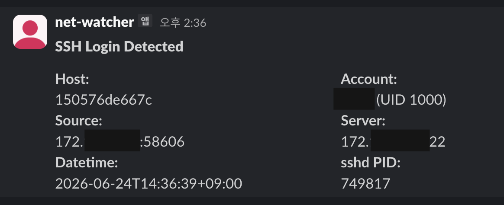

# eBPF SSH Login Alert to Slack

[한국어 문서](./README.ko.md)

A Linux agent that detects OpenSSH session starts and sends an alert to Slack.

## How detection works

The eBPF program attaches to the `syscalls:sys_enter_execve` tracepoint. When an authenticated `sshd` process starts a user's shell or remote command, it:

1. checks that the current process name is `sshd`,
2. reads OpenSSH's `SSH_CONNECTION=<client-ip> <client-port> <server-ip> <server-port>` environment variable,
3. sends PID, UID, and connection metadata to Go through a ring buffer,
4. resolves the UID to a local account name and sends the alert to Slack.



## Privacy notice

When deployed, this agent sends SSH login metadata to Slack:

- source IP address and port,
- target server IP and port,
- local account name and UID,
- host name,
- login timestamp,
- `sshd` PID.

## Requirements

- Linux 5.8 or newer recommended
- Docker
- Go 1.24 or newer, clang/llvm, and libbpf headers only when building locally without Docker
- root, privileged container execution, or equivalent eBPF capabilities and kernel filesystem mounts

## Local build

```bash
make build
```

`go generate` compiles the eBPF C program and embeds the generated object into Go code through `bpf2go`.

## Docker image build and push

Build and push the Docker image:

```bash
docker build -t <your-image-name> . 
docker push <your-image-name>
```

The Dockerfile uses a multi-stage build. The builder image installs Go, clang/llvm, libbpf headers, and make. The runtime image contains only the compiled agent plus CA certificates and timezone data.

## Slack `chat.postMessage` setup

1. Create an app at [Slack API Apps](https://api.slack.com/apps).
2. Add the `chat:write` Bot Token Scope under **OAuth & Permissions**.
3. Install or reinstall the app to your workspace.
4. Copy the Bot User OAuth Token (`xoxb-...`).
5. Invite the app to the destination channel: `/invite @your-app-name`.
6. Copy the Channel ID (`C...`).

## Run with Docker

Dry run without sending Slack messages:

```bash
docker run --rm \
  --name ssh-login-alert \
  --privileged \
  --pid=host \
  -v /sys/kernel/tracing:/sys/kernel/tracing:rw \
  -v /sys/fs/bpf:/sys/fs/bpf:rw \
  -v /etc/passwd:/etc/passwd:ro \
  -v /etc/group:/etc/group:ro \
  1hcoj/alert-ssh-login-to-slack:latest \
  -dry-run
```

Run with Slack alerts enabled:

```bash
docker run -d \
  --name ssh-login-alert \
  --restart unless-stopped \
  --privileged \
  --pid=host \
  -e SLACK_BOT_TOKEN='xoxb-...' \
  -e SLACK_CHANNEL_ID='C0123456789' \
  -v /sys/kernel/tracing:/sys/kernel/tracing:rw \
  -v /sys/fs/bpf:/sys/fs/bpf:rw \
  -v /etc/passwd:/etc/passwd:ro \
  -v /etc/group:/etc/group:ro \
  1hcoj/alert-ssh-login-to-slack:latest \
  -timezone Asia/Seoul
```

Why these options are used:

- `--privileged` allows the container to load and attach eBPF programs.
- `--pid=host` keeps process visibility aligned with the host.
- `/sys/kernel/tracing` exposes tracepoint metadata used by eBPF attach logic.
- `/sys/fs/bpf` exposes the host BPF filesystem when needed by the kernel/eBPF stack.
- `/etc/passwd` and `/etc/group` let the container resolve host UIDs to host account names.
- `--restart unless-stopped` makes Docker restart the agent after crashes or host reboots when the Docker daemon starts.

## Project structure

```text
.
├── bpf/
│   └── sshlogin.bpf.c        # eBPF program attached to execve tracepoint
├── bpf_bpfeb.go              # Generated bpf2go binding for big-endian targets
├── bpf_bpfel.go              # Generated bpf2go binding for little-endian targets
├── Dockerfile                # Multi-stage Docker build
├── generate.go               # go:generate entrypoint for bpf2go
├── main.go                   # Agent lifecycle, eBPF attach, ring buffer handling
├── slack.go                  # Slack chat.postMessage client
├── *_test.go                 # Unit tests
├── Makefile                  # generate/build/test helpers
├── LICENSE                   # Repository license
├── README.md                 # English documentation
└── README.ko.md              # Korean documentation
```

## License

This project is distributed under the MIT License. See the [LICENSE](./LICENSE) file for details.

For compatibility with the Linux kernel's eBPF subsystem, the eBPF programs declare the license string as Dual MIT/GPL at load time. This allows the kernel to recognize the programs as GPL-compatible and enables access to GPL-restricted eBPF helpers where required. The overall project, however, remains distributed under the MIT License.
